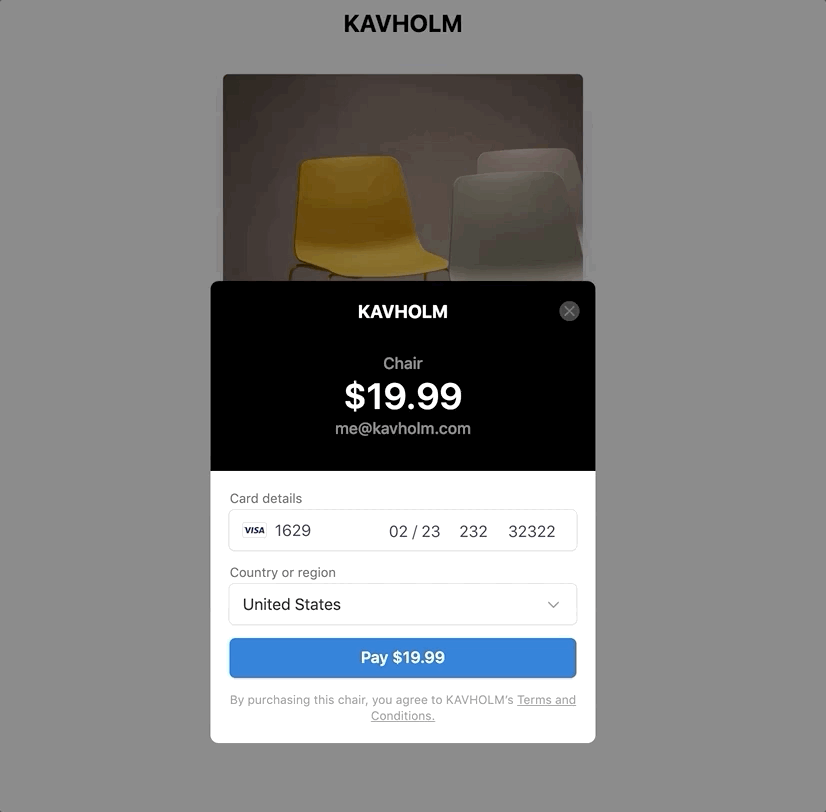

# Stripe Elements modal demo

This demo shows how to implement [Stripe Elements](https://stripe.com/payments/elements) within a modal dialog using [Payment Intents API](https://stripe.com/docs/payments/payment-intents/quickstart#automatic-confirmation-flow).

- [Payment Request API (i.e Apple Pay)](https://stripe.com/docs/stripe-js/elements/payment-request-button) reference implementation with PaymentIntents in [this folder](../payment-request-api)

## Payment success


## Payment declined



## Run the demo

This project includes an example Express server that serves the `/client` folder and
hosts an endpoint to create a payment intent with the [Payment Intents API](https://stripe.com/docs/api/payment_intents/create).

- Edit the `client/elementsModal.js` and add your public Stripe key on
  [line 4](client/elementsModal.js#L4).
- Edit the `HOST_URL` on [line 7](client/elementsModal.js#L7).
- Edit the endpoint for `/payment_intents`, defined on [line 447
  ](client/elementsModal.js#L444) for the modal dialog.
- Edit the endpoint for `/payment_intents`, defined on
  [line 33](server/node/server.js#L33) for the server.

You can customize the payment form further to meet your needs. For example, you can change the footer text on
[line 418](client/elementsModal.js#L419-L424).

### Copy the env file, install the dependencies, and start the server:

```
# Add your Stripe API keys to your .env
cp .env.example .env
npm install
npm start
```

Go to [http://localhost:4242](http://localhost:4242) to see the payment page and create a test charge.

### 1. Download the project [ZIP file](https://github.com/stripe-samples/payment-form-modal/archive/master.zip)

This Elements modal demo uses one CSS and one JS file (feel free to customize them to your needs.) Include them in the `<head>` of your page source:

```
<meta name="viewport" content="width=device-width, initial-scale=1" />
<link rel="stylesheet" href="elementsModal.css">
<script src="https://js.stripe.com/v3/"></script>
<script src="elementsModal.js"></script>
```

### 2. Create the Elements modal

You can create the modal by providing a few options

```
window.elementsModal.create({
  items: [{ sku: "sku_1234", quantity: 1 }],
  currency: "USD",
  businessName: "KAVHOLM",
  productName: "Chair",
  customerEmail: "me@kavholm.com",
  customerName: "Customer Kavholm"
});
```

Here are the options the demo allows you to configure:

| Name                      | Description                                                                                   | Type   |
| ------------------------- | --------------------------------------------------------------------------------------------- | ------ |
| items (required)          | An array with a product^ object                                                               | array  |
| product^ (object)         | A product SKU (string) and quanity (int) of that SKU                                          | object |
| currency (required)       | A [supported currency](https://stripe.com/docs/currencies#presentment-currencies)             | string |
| businessName (required)   | Business name                                                                                 | string |
| productName (optional)    | Name of the product                                                                           | string |
| customer email (optional) | Customer email to display                                                                     | string |
| customer name (required)  | Customer name to create [Payment intents](https://stripe.com/docs/api/payment_intents/create) | string |

### 3. Show the Elements modal

You can call `elementsModal.show()` or use a button:

```
<button onClick="window.elementsModal.toggleElementsModalVisibility();">
  Click here to trigger the Elements popup modal
</button>
```

### 4. Update the stripePaymentHandler function

The [stripePaymentHandler](client/elementsModal.js#L550)
is set to redirect users to "/payment_intent_charge." This does a GET request to the server and fetches
a static HTML page. Change this function to take action once a payment is completed.

### A short example using this demo:

```

<html>
  <head>
    <meta name="viewport" content="width=device-width, initial-scale=1" />
    <link rel="stylesheet" href="elementsModal.css" />
    <script src="https://js.stripe.com/v3/"></script>
    <script src="elementsModal.js"></script>
  </head>
  <body>
    <div class="pay-button-wrapper">
      <button class="pay-button" onClick="elementsModal.toggleElementsModalVisibility();">
        Open Elements popup
      </button>
    </div>
  </body>

  <script>
    window.elementsModal.create({
      items: [{ sku: "sku_1234", quantity: 1 }],
      currency: "USD",
      businessName: "KAVHOLM",
      productName: "Chair",
      customerEmail: "me@kavholm.com",
      customerName: "Customer Kavholm"
    });
  </script>
</html>
```
